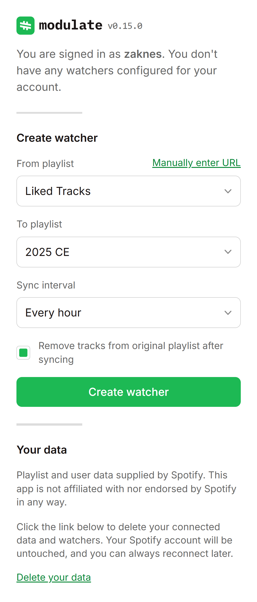

  <picture>
    <source media="(prefers-color-scheme: dark)" srcset="https://github.com/zaknesler/modulate/assets/7189795/1c5f53fc-d014-4e7b-8c61-7122dedb7445">
    
  </picture>

I like keeping my favorite Spotify tracks in playlists labeled by year (e.g. a playlist called "2023") but it's annoying to add tracks to playlists manually.

This tool allows you to transfer the tracks from one playlist to another on an interval. Most importantly, this also includes moving tracks from your liked/saved playlist, so you can press ❤️ and go on with your obviously busy life.

Once you connect your Spotify account and configure a watcher, it'll stay running and auto-transfer your tracks on the interval you choose (e.g. every hour/week/day). You can also configure it to just copy tracks instead of removing them. For example, you can keep your saved tracks synced to a collaborative playlist with your friends, or vice-versa.

  
<strong>View screenshot</strong>

  <picture>
    <source media="(prefers-color-scheme: dark)" srcset=".github/assets/dark.png">
    
  </picture>

#### Usage

If you'd like to run it for yourself:

1. Create a [Spotify developer application](https://developer.spotify.com/dashboard)
1. Clone this repo
1. `cp .env.example .env`
1. Add Spotify creds to `.env`
1. `touch .data/modulate.db`
1. `cargo run`
1. Go to [`localhost:4000`](http://localhost:4000), sign in, and configure

#### Thanks

A few honorable mentions:

- [axum](https://github.com/tokio-rs/axum) — to provide a web interface
- [oauth2](https://github.com/ramosbugs/oauth2-rs) — for authenticating with Spotify API
- [askama](https://github.com/djc/askama) — for HTML templating
- [rusqlite](https://github.com/rusqlite/rusqlite) — for easily storing tokens and watchers
- [r2d2](https://github.com/sfackler/r2d2) — for managing the db connection
